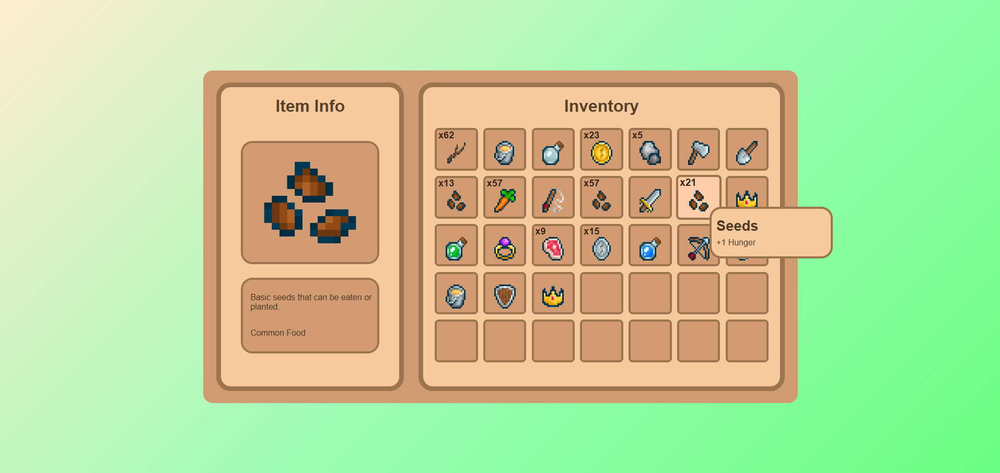

# Inventory System UI

This project is a Inventory System User Interface designed for games or applications that require an intuitive inventory management solution. It includes graphical assets, HTML structure, and TypeScript configurations to create and manage a inventory.

## Features

- **Dynamic Inventory Grid:** Adjustable grid size with rows and columns.
- **Item Management:**
    - Add items dynamically with random properties.
    - Swap or merge items based on item type and stack limits.
    - Split item stacks into smaller amounts.
    - Drop items with a single keypress.
- **Tooltip System:** Displays item details dynamically as the mouse hovers over an inventory slot.
- **Interactive Highlighting:** Visual feedback for selected slots.
- **Keyboard & Mouse Input:** Includes context menu (right-click) for splitting stacks and keyboard shortcuts for quick actions.
- **Customizable Stack Size:** Adjust the maximum stack size for each item type.

## Controls

1. **Keyboard Shortcuts**
   - **D:** Drop the currently hovered item from the inventory.

2. **Mouse Interactions**
   - **Left-Click:** Select an item or swap it with another slot.
   - **Right-Click:** Split item stacks (if applicable).
   - **Hover:** Show a tooltip with item details.

## Setup Instructions

1. Extract the contents of the zip file.
2. Open `InventorySystem.html` in a web browser to preview the system.

## How to Use

1. Open the `InventorySystem.html` file in a web browser to view and interact with the inventory system.
2. Customize the assets by replacing images in the `assets/` folder.

## Further Enhancements for Improvement

1. **Drag-and-Drop Support:** Allow users to drag items between slots.
2. **Item Filtering:** Add category-based filters for inventory browsing.
3. **Save/Load Functionality:** Enable persistent inventory storage using local storage or a backend service.
4. **Sorting System:** Automatically organize items by type, rarity, or name.

## Assets Used
1. [Basic Pixel Art Icon Pack for Games](https://b3rries.itch.io/pixel-art-icon-pack)
    - By b3rries

## Preview

---

Feel free to expand or modify the inventory system to suit your specific needs!
